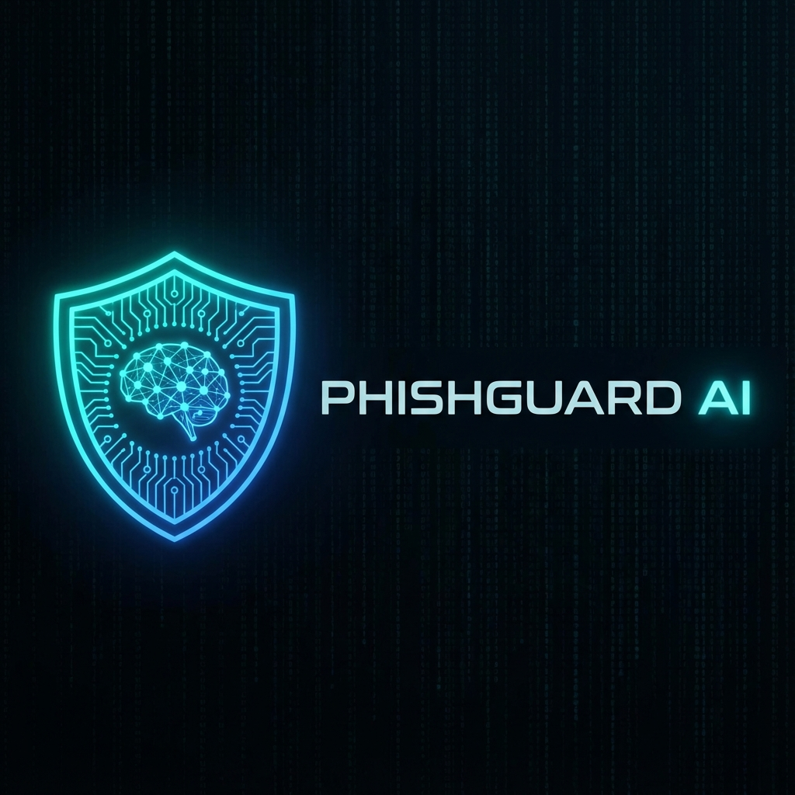
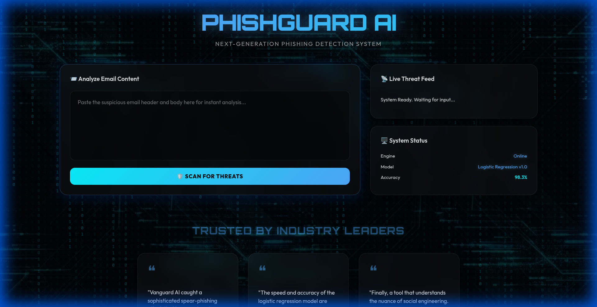

<div align="center">



# 🛡️ PhishGuard AI

### Next-Generation AI-Powered Phishing Detection System

[](https://choosealicense.com/licenses/mit/)
[](https://www.python.org/downloads/)
[](https://reactjs.org/)
[](https://fastapi.tiangolo.com/)
[](http://makeapullrequest.com)

**🌐 [View Live Demo](https://sr-857.github.io/phishguard-ai/)** | 
[Features](#-features) •
[Installation](#-installation) •
[Usage](#-usage) •
[Architecture](#-architecture) •
[API](#-api-documentation) •
[Contributing](#-contributing)

</div>

---

## 🎯 Overview

**PhishGuard AI** is an advanced, real-time phishing email detection system that leverages machine learning to protect users from sophisticated phishing attacks. Built with a modern tech stack featuring React, FastAPI, and scikit-learn, it provides instant threat analysis with **98.3% accuracy**.

### Why PhishGuard AI?

- **🎯 High Recall (91.3%)**: Minimizes false negatives to catch more phishing attempts
- **⚡ Real-Time Analysis**: Instant email classification with confidence scores
- **🎨 Modern UI**: Cybersecurity-themed dashboard with glassmorphism and neon aesthetics
- **🔒 Privacy-First**: All processing happens locally - no data sent to third parties
- **📊 Transparent**: View detailed forensic analysis and model confidence for every prediction

---

## ✨ Features

### Core Functionality
- ✅ **AI-Powered Detection**: Logistic Regression model trained on SMS Spam Collection dataset
- ✅ **Real-Time Threat Feed**: Live history of scanned emails with threat levels
- ✅ **Confidence Scoring**: Probability-based classification with detailed analysis
- ✅ **System Health Monitoring**: Real-time backend connectivity status

### User Experience
- 🎨 **Cybersecurity Dashboard**: Dark mode with glassmorphism effects
- 🌊 **Digital Rain Animation**: Matrix-style background for immersive experience
- 🎯 **Custom Cursor**: Targeting crosshair design for enhanced UX
- 📱 **Responsive Design**: Works seamlessly across all devices
- ⭐ **Testimonials Section**: Industry leader endorsements

### Technical Features
- 🔄 **RESTful API**: FastAPI backend with automatic documentation
- 📦 **Modular Architecture**: Separation of concerns for maintainability
- 🧪 **Comprehensive Testing**: Model evaluation with multiple metrics
- 📝 **Detailed Logging**: Full request/response tracking
- 🚀 **Easy Deployment**: One-command launch script

---

## 🎬 Demo

### Dashboard Interface



### Key Capabilities

1. **Email Analysis**: Paste suspicious email content for instant classification
2. **Threat Visualization**: Color-coded results (Red = Phishing, Green = Safe)
3. **Forensic Details**: Expandable technical analysis with raw model output
4. **Scan History**: Chronological feed of all analyzed emails
5. **System Status**: Real-time engine health monitoring

### 🎥 Live Demo

Watch PhishGuard AI in action:


**Try it yourself:**
1. Clone the repository
2. Run `./run_system.sh`
3. Open http://localhost:5173
4. Paste a suspicious email and click "SCAN FOR THREATS"

---

## 🛠️ Tech Stack

### Frontend
- **Framework**: React 18 with Vite
- **Styling**: Vanilla CSS with custom animations
- **Fonts**: Google Fonts (Outfit, Orbitron)
- **Effects**: Glassmorphism, Digital Rain, Custom Cursors

### Backend
- **Framework**: FastAPI
- **Server**: Uvicorn (ASGI)
- **CORS**: Enabled for cross-origin requests

### Machine Learning
- **Algorithm**: Logistic Regression
- **Feature Engineering**: TF-IDF Vectorization
- **Text Processing**: NLTK (stopwords, stemming)
- **Model Persistence**: Joblib
- **Evaluation**: scikit-learn metrics

### Data
- **Dataset**: SMS Spam Collection (UCI ML Repository)
- **Size**: 5,574 messages
- **Split**: 80% training, 20% testing

---

## 📦 Installation

### Prerequisites

- Python 3.8+
- Node.js 16+
- npm or yarn
- Git

### Clone Repository

```bash
git clone https://github.com/sr-857/phishguard-ai.git
cd phishguard-ai
```

### Backend Setup

```bash
# Install Python dependencies
pip install -r requirements.txt

# Download NLTK data (automatic on first run)
python -c "import nltk; nltk.download('stopwords')"

# Train models (if not already trained)
python src/model_trainer.py
```

### Frontend Setup

```bash
# Navigate to frontend directory
cd frontend

# Install dependencies
npm install

# Return to root
cd ..
```

---

## 🚀 Usage

### Quick Start (Recommended)

```bash
# Launch both frontend and backend with one command
./run_system.sh
```

This will start:
- **Backend API**: http://localhost:8000
- **Frontend Dashboard**: http://localhost:5173

### Manual Start

#### Backend Only
```bash
uvicorn src.api:app --reload --port 8000
```

#### Frontend Only
```bash
cd frontend
npm run dev
```

### Testing the System

1. Open http://localhost:5173 in your browser
2. Paste a suspicious email in the text area
3. Click "🛡️ SCAN FOR THREATS"
4. View results and confidence score
5. Check the Live Threat Feed for history

### Example Phishing Email

```
URGENT! You have won a £100,000 Prize Jackpot! 
Click here to claim: http://suspicious-link.com
Reply with your bank details to: scammer@fake.com
```

---

## 📚 API Documentation

### Base URL
```
http://localhost:8000
```

### Endpoints

#### Health Check
```http
GET /
```

**Response**
```json
{
  "status": "online",
  "model": "Logistic Regression"
}
```

#### Predict Email
```http
POST /predict
Content-Type: application/json
```

**Request Body**
```json
{
  "text": "Your email content here"
}
```

**Response**
```json
{
  "label": "Phishing/Spam",
  "probability": "0.9234",
  "raw_text": "Your email content here"
}
```

### Interactive API Docs

Visit http://localhost:8000/docs for Swagger UI documentation.

---

## 📊 Model Performance

### Metrics (Logistic Regression)

| Metric | Score |
|--------|-------|
| **Accuracy** | 98.3% |
| **Precision** | 98.5% |
| **Recall** | 91.3% |
| **F1-Score** | 94.8% |

### Why Logistic Regression?

We chose Logistic Regression over Naive Bayes and Random Forest because:

1. **High Recall**: 91.3% recall minimizes false negatives (missed phishing emails)
2. **Fast Inference**: Real-time predictions with minimal latency
3. **Interpretability**: Clear feature importance for transparency
4. **Efficiency**: Low memory footprint and quick training

---

## 📁 Project Structure

```
phishguard-ai/
├── .github/                    # GitHub assets
│   ├── logo.png               # Repository logo
│   └── dashboard-demo.png     # Demo screenshot
├── frontend/                   # React application
│   ├── public/
│   │   └── cyber_background.png
│   ├── src/
│   │   ├── components/
│   │   │   ├── DigitalRain.jsx
│   │   │   └── Testimonials.jsx
│   │   ├── App.jsx
│   │   ├── App.css
│   │   └── main.jsx
│   ├── index.html
│   ├── package.json
│   └── vite.config.js
├── src/                        # Backend & ML
│   ├── api.py                 # FastAPI server
│   ├── data_loader.py         # Dataset handling
│   ├── features.py            # Feature engineering
│   ├── model_trainer.py       # Model training
│   ├── evaluation.py          # Performance metrics
│   └── inference.py           # Prediction engine
├── models/                     # Trained models
│   ├── Logistic_Regression.pkl
│   ├── tfidf_vectorizer.pkl
│   └── ...
├── .gitignore
├── requirements.txt
├── run_system.sh              # Launch script
├── CONTRIBUTING.md
├── CODE_OF_CONDUCT.md
├── SECURITY.md
└── README.md
```

---

## 🤝 Contributing

We welcome contributions! See [CONTRIBUTING.md](CONTRIBUTING.md) for guidelines.

### Quick Start

1. Fork the repository
2. Create a feature branch (`git checkout -b feature/AmazingFeature`)
3. Commit your changes (`git commit -m 'Add some AmazingFeature'`)
4. Push to the branch (`git push origin feature/AmazingFeature`)
5. Open a Pull Request

---

## 📄 License

This project is licensed under the MIT License - see the [LICENSE](LICENSE) file for details.

---

## 👨‍💻 Contact

**Developer**: Subhajit Roy

- 📧 Email: subhajitroy857@gmail.com
- 💼 LinkedIn: [linkedin.com/in/sr857](https://linkedin.com/in/sr857)
- 🐙 GitHub: [github.com/sr-857](https://github.com/sr-857)

---

## 🙏 Acknowledgments

- **Dataset**: [SMS Spam Collection](https://archive.ics.uci.edu/ml/datasets/sms+spam+collection) from UCI ML Repository
- **Inspiration**: Modern cybersecurity dashboards and threat intelligence platforms
- **Libraries**: React, FastAPI, scikit-learn, NLTK, and the amazing open-source community

---

<div align="center">

### ⭐ Star this repository if you found it helpful!

Made with ❤️ and ☕ by [Subhajit Roy](https://github.com/sr-857)

</div>
